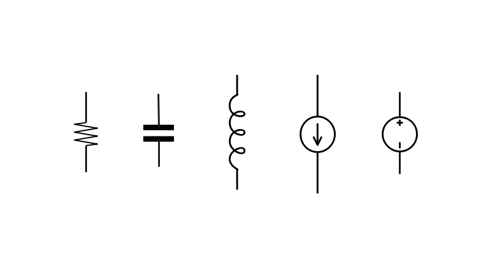
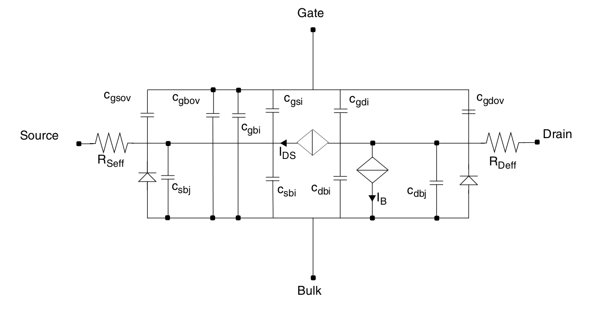
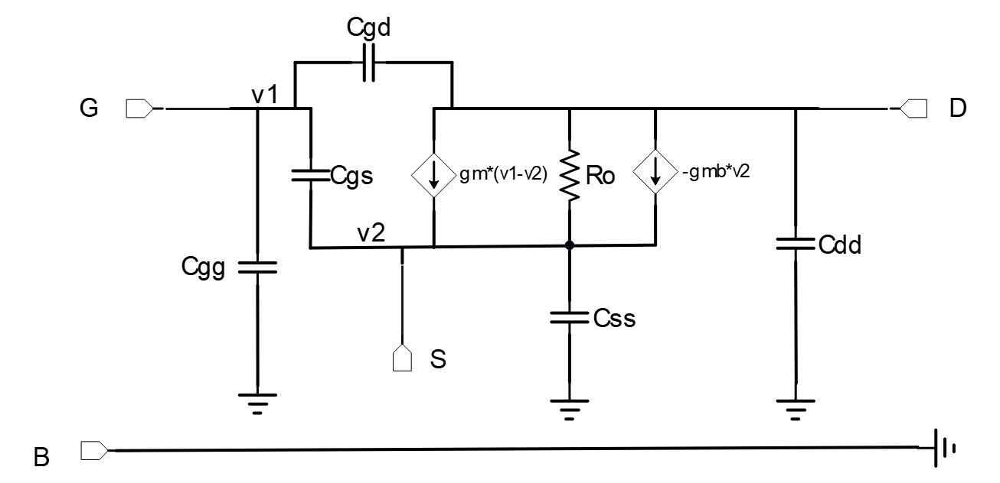

# Element-Level Circuit Description(Chinese Version [Click Here](https://github.com/ZichaoLong/hierarchical-circuit-equations-constructor/blob/master/doc/netlist-json.md))

<center>Zichao Long</center>

A netlist in JSON format can be regarded as a hardware description language (HDL) [[1]](#pecheux2005vhdl), with its structural part as the main body and the behavioral description part separately processed in the subcircuit-defined [SubModel field](#subckt-extension-based-on-the-response).

To help understanding, the following describes some key concepts involved in <font color=orange>hardware description languages</font> that have similar counterparts in <font color=green>general programming languages</font>:

1. <font color=orange>Netlist</font>: the <font color=green>code</font> in open-source JSON format for describing a circuit.
2. <font color=orange>Netlist parser</font>: the <font color=green>compiler</font>. The [<font color=orange>subcircuits</font>](#subckts) at each level defined by hierarchical nesting (as basic compute units like <font color=green>class or function objects</font>) will be compiled into computation rules and instantiated into objects with private data. The smallest-granularity subcircuits are considered as [basic elements](#basic-instance-type).
3. <font color=orange>Equations system constructor</font>: the <font color=green>executor</font>. Targeting different simulation types, a custom computational graph is used as an equations system constructor to calculate equation remainders and Jacobian matrices of each nested subcircuit instance. Take TRAN analysis as an example. $\pmb{Q},\pmb{F}$ and sparse Jacobian matrix $\nabla_{\pmb{x}}\pmb{Q},\nabla_{\pmb{x}}\pmb{F},\nabla_{\pmb{p}}\pmb{Q},\nabla_{\pmb{p}}\pmb{F}$ need to be calculated, where $\pmb{x}$ denotes the unknown of the equations and $\pmb{p}$ the design variables or input parameters.

[TOC]

## <span id=basic-circuit-element>Structure of a Simulable Netlist</span>

A simulable JSON netlist includes the following top-level keys.

| Top-Level Key| Description| Counterpart in a General Programming Language ||
|--------------|------------|-------------------------------------|---------|
| `FileId`| File ID string| Macro guards for C/C++ header files | Required|
| `include`| Other netlists included in nesting| Include C/C++ header files | Optional|
| `GlobalVariable`| Global variables| Global variables| Optional|
| `SubCkts`| Subcircuits| Classes/Functions| Optional|
| `Simulation`| Simulation conditions| Execution entry| Optional|
| `PreLoad`| External library preloader | Runtime dynamic library loading| Optional|
| `Others`| No action required| Comments| Optional|

In circuit description languages, many concepts — such as `FileId`, `include`, and `GlobalVariable` — have similar counterparts in compilation languages. For `SubCkts` and `Simulation` in particular, there are a few points to note:

1. Defining a subcircuit module (`subckt`) is almost the same as defining a class (`Class`). The impacts of external inputs (including external nodes and parameters) on intrinsic parameters and external responses must be defined. Subcircuit definitions are all placed in `SubCkts`.

---

*Remarks: A subcircuit differs significantly from a function/class of a general programming language in the following aspect: In a function, the information transfer from inputs to outputs is unidirectional. In a subcircuit, however, the external state interacts with the internal state in all types of analog signal simulation. These states are coupled by a system of physical equations (e.g., conservation laws). Once the system of equations is solved, the circuit-level state is obtained.*

The function of the computational graphs is to construct systems of equations, which can further be utilized for solving systems of equations.

---


2. The rest of the information required to properly initiate circuit simulation is defined in `Simulation`, including the following:
   - `PVT` information: such as process and temperature information. Devices of the same size show different physical properties under different `PVT` combinations.
   
   - Definition of the circuit to be simulated, which is like a C/C++ `main` function.
   
   - Simulation options based on the simulation type:
     
     - DC steady-state analysis (`DC`): For example, specify the solving method in the options.
     - AC small-signal analysis (`AC`): For example, specify the scan frequency in the options.
     - Transient analysis (`TRAN`), also known as large-signal analysis: For example, specify the time step in the options.
     
     More... (e.g., `DCAC` hybrid analysis)

The terms "class" and "`main` function" in programming languages are mentioned only for easier understanding of the "`subckt`" and "simulation entry circuit" concepts. In practical netlist parsing, `subckt` does not necessarily need to be compiled into classes, especially in optimizing storage and performance for larger-scale circuit simulation. Suitable data structures should be chosen in specific situations.

### <span id=subckts>Subcircuit Definition and Instantiation Statement</span>

This section discusses the structural part (netlist) of HDLs. For the behavioral description part, see [Subcircuit Extension Method Based on Circuit Response](#subckt-extension-based-on-the-response).

1. Every key-value pair in the `SubCkts` field represents the definition of a **subcircuit**, or **element**.
2. A subcircuit may consist of many lower-layer subcircuits. For a simulation, the smallest-granularity subcircuits are called **basic elements** [[2]](#gunther2005modelling)[[6]](#najm2010circuit). In essence, we can represent any circuit using a combination of basic elements.
3. To use or instantiate a subcircuit, we can set the key-value pairs of its **node mappings** (`ExternalNodes`) and **parameters** (`InputParams`) in the netlist.

#### <span id=basic-instance-type>Basic Elements</span>

The following table provides a list of supported basic elements.

| `MasterName`| `ExternalNodes`| `InputParams`| Remarks|
|-------------|----------------|--------------|----------|
| `resistor`| `left,right`| `resistance`| Resistor|
| `capacitor`| `input,output`| `capacitance`| Capacitor|
| `ncapacitor`| `OLDC,input,output`| `capacitance`| Old capacitance in simulation |
| `inductor`| `input,output`| `inductance`| Inductor|
| `ninductor`| `OLDL,input,output`| `inductance`| Old inductance in simulation |
| `CS`| `input,output`| `current`| Current Source|
| `VS`| `input,output`| `voltage`| Voltage Source|
| `ICS`| `input,output`| `dc,ac`| Ideal Current Source |
| `IVS`| `input,output`| `dc,ac`| Ideal Voltage Source|
| `IPROBE`| `left,right`| none | IPROBE|
| `VCCS`| `left,right,input,output`| `MF`| Voltage Controlled Current Source|
| `CCCS`| `iorigin,input,output`| `MF`| Current Controlled Current Source|
| `VCVS`| `left,right,input,output`| `MF`| Voltage Controlled Voltage Source|
| `CCVS`| `iorigin,input,output`| `MF`| Current Controlled Voltage Source |
| `ACVCCS`| `left,right,input,output`| `MF`| `AC` Voltage Controlled Current Source|

Specifically, `dc,ac` of `ICS,IVS` represent the current and voltage values in `DC/TRAN,AC` analysis; `IPROBE` represents a voltage source of `voltage` = 0 in `DC` analysis or a current source of `current` = 0 in `AC` analysis; and the `MF` parameter of controlled current/voltage sources `VCCS,CCCS,VCVS,CCVS,ACVCCS` represents the amplification factor, wherein `ACVCCS` provides current only in `AC` analysis. Compared with `capacitor,inductor`, `ncapacitor,ninductor` has an additional degree of freedom `OLDC,OLDL` to store the old capacitance and inductance values in simulation.

Note that memristors are not discussed here.

The following figure depicts the symbols of a resistor, capacitor, inductor, current source, and voltage source from left to right.



---

Supplementary information from [[6, Section 2]](#najm2010circuit): Consider a two-terminal element. Let $v(t)$ be the voltage difference between the two terminals of the element and $i(t)$ be the branch current.

- Passive element: An element is considered passive element if its basic element equation (i.e., constitutive relationship) can be written as 
  $$
  i=f(v,\dot{v})\ or\ v=f(i,\dot{i}).
  $$
  If $f$ is linear, the element is a linear element; otherwise, it is a nonlinear element. If $v=f(i)$ or $i=f(v)$, the element is a resistive element; otherwise, it is a dynamic element.
  
  - Resistor: A resistors is voltage-controlled if $i=f(v)$ or current-controlled if $v=f(i)$. Most resistors are voltage-controlled ones.
  - Capacitor: Charge $q$ can be denoted as $q=f(v)$. As such $i=\frac{dq}{dt}\triangleq C(v)\cdot\frac{dv}{dt}$ for $C(v)=\frac{dq}{dv}$.
  - Inductor: Magnetic flux $\phi$ can be denoted as $\phi=f(i)$. According to [Faraday's law of induction](https://en.wikipedia.org/wiki/Faraday%27s_law_of_induction), $v=\frac{d\phi}{dt}\triangleq L(i)\cdot\frac{di}{dt}$ holds for $L(i)=\frac{d\phi}{dv}$.

- Active element: An element is considered active element as long as any of the following four conditions is satisfied. Given $v,i$,
  
  - if $v=f(t)$, the element is an independent voltage source;
  - if $i=f(t)$, the element is an independent current source;
  - if $v=f(i_{origin})$ (i.e., $v$ depends only on the other branch of current $i_{origin}$), the element is a controlled voltage source (`CVS`);
  - if $i=f(v_{origin})$ (i.e., $i$ depends only on the voltage difference $v_{origin}$ between the other two nodes), the element is a controlled current source (`CCS`).
  
  The two controlled sources are also denoted as `CCVS,VCCS`, which derive the variants `VCVS,CCCS`, as listed earlier. When constructing an equation, the impact of the controlled sources and independent sources on the left and right sides of the equation must be identified separately.

The collection of passive and active elements are referred to collectively as lumped elements. The elements (e.g., transmission lines) that fall outside this collection are referred to as distributed devices. A circuit consisting of lumped elements is referred to as a lumped circuit, otherwise a distributed circuit. The two categories show a number of distinct physical differences: When the wavelength of the electromagnetic field is much larger than the circuit size, the impact of electromagnetic waves on each device or node can be ignore, and the lumped circuit is used for modeling. Conversely, when the impact of electromagnetic waves cannot be ignored (e.g., on devices in RF circuit simulation), many characteristics cannot be modeled using lumped circuits.

In practice, most of the devices can be replaced with equivalent circuits composed of the preceding basic elements [[6, Section 2.1.3]](#najm2010circuit), achieving good approximations in most cases.

---


#### Instantiation Statement

An instantiation statement of a custom subcircuit is similar to that of a basic element. The instance name is used as the key, followed by the master name, external nodes, and parameter values. For example, for a resistor valued `1e5` with its left and right ports respectively connected to nodes `vin,vout`, its instantiation statement should look like this

```json
"r0":{
    "MasterName":"resistor",
    "ExternalNodes":{"left":"vin","right":"vout"},
    "InputParams":{"resistance":1e5},
    "ExternGALV":false
}
```

- `r0`: indicates the instance name.
- `MasterName`: indicates the class (or master) of the instance.
- `ExternalNodes`: indicates the connection of the instance's external nodes (i.e., external nodes `left,right` are connected to `vin,vout`, respectively).
- `InputParams`: indicates the parameters of the instance.
- `ExternGALV`: for details, see [Galvanometer of Basic Elements](#internalnodes-and-galv-refrence).
- `ExternalNodes,InputParams`: both can be considered as the input parameters of the function in programming languages.

#### <span id=custom-subckt>Custom Subcircuits</span>

A simple resistor-capacitor series circuit named `RC` is used as an example to discuss how to create a simple user-defined subcircuit. For the behavior modeling of subcircuit modules, see [Subcircuit Extension Method Based on Circuit Response](#subckt-extension-based-on-the-response). That section shows that common devices and subcircuits including MOS can be assembled and expressed using this basic element extension method. In this method, the intrinsic parameters and their computation involved in behavior modeling are processed in one field.

```json
"RC":{
    "comment":"A component in an operational amplifier",
    "ExternalNodes":["left","right"],
    "InputParams":["R","C"],
    "DefaultParVals":{"R":1e5,"C":1e-13},
    "InternalNodes":["vm"],
    "Schematic":{
        "Rm":{"MasterName":"resistor",
              "ExternalNodes":{"left":"left","right":"vm"},
              "InputParams":{"resistance":"R"}},
        "Cm":{"MasterName":"capacitor",
              "ExternalNodes":{"input":"vm","output":"right"},
              "InputParams":{"capacitance":"C"}}
    }
}
```

| Subcircuit Definition| Description| Remarks| Example|
|----------|----------|----------|----------|
| `ExternalNodes`| External node names| Required| `["left","right"]`|
| `InputParams`| Input parameter names| Required| `["R","C"]`|
| `InternalNodes`| Internal node names| Required| `["vm"]`|
| `Schematic`| Internal subcircuit decomposition| Required| `{"Rm":{...},"Cm":{...}}` |
| `SubModel`| Submodel for computing intrinsic parameters| Optional| [Subcircuit Extension Method Based on Circuit Response](#subckt-extension-based-on-the-response) |
| `DefaultParVals`| Default values of the input parameters| Optional| `{"R":1e5,"C":1e-13}`|

In `Schematic`, internal subcircuit decomposition contains statements for instantiating the `Rm,Cm` subcircuits.

> ```
> "Schematic":{
>        "Rm":{"MasterName":"resistor",
>              "ExternalNodes":{"left":"left","right":"vm"},
>              "InputParams":{ "resistance":"R"}},
>        "Cm":{"MasterName":"capacitor",
>              "ExternalNodes":{"input":"vm","output":"right"},
>              "InputParams":{"capacitance":"C"}}
> }
> ```

1. The classes of `Rm,Cm` are specified by `MasterName`. The classes are respectively `resistor,capacitor`, which (coincidentally in this example) belong to basic elements.

2. The external nodes of `Rm,Cm` are connected to some nodes in `ExternalNodes` and `InternalNodes`. Specifically, for `Rm`, its `left` node is connected to `left` of the upper-layer circuit `RC`, and its `right` is connected to the upper-layer internal node `vm`. From the compilation perspective, the `ExternalNodes` perception domains of `Rm,Cm` include:
   
   - Upper-layer `ExternalNodes`
   - Upper-layer `InternalNodes`
   
   `ExternalNodes` referenced in `Schematic` = Defined `ExternalNodes`+`InternalNodes`.

3. The `InputParams:resistance,capacitance` parameters of `Rm,Cm` are directly mapped from the upper-layer input parameters `R,C`. From the compilation perspective, the perception domains for computing `InputParams` of `Rm,Cm` include:
   
   - Global variables `GlobalVariable`
   - Upper-layer `InputParams`
   - Parameters in the `IntrinsicParams` field. For details, see [Subcircuit Extension Method Based on Circuit Response](#subckt-extension-based-on-the-response).
   
   `InputParams` referenced in `Schematic` $\subset$ Defined `InputParams`+`IntrinsicParams`+`GlobalVariable`.
   
   The current example involves a direct reference of `InputParams`. `GlobalVariable` and `IntrinsicParams` can be referenced in the same way. Specifically, to reference the latter, `SubModel` needs to be invoked to calculate intrinsic parameters in the simulation process.

---

*Remarks: When we consider the complete implementation of parameter mapping, we need to discuss the internal and external dependencies of subcircuit parameters from the compilation perspective. Physically, the intrinsic parameter/variable values depend on external input `InputParams` and internal and external node signals, where the `DC,AC` simulation parameters depend on `DC` steady signals, and the `TRAN` simulation parameters depend on `TRAN` instantaneous signals.*

*Once we have identified the dependencies, we can then define a larger class of devices, such as [resistors whose resistance is size-dependent](#example-size-dependent-resistor). In a typical MOS model (e.g., [BSIM](https://bsim.berkeley.edu/)), a MOS device is equivalent to a subcircuit (BSIM4 [[3]](#liu2001mosfet)[[4]](#spectremod)). The state of the intrinsic parameters depends on the MOS size and four bias voltage values. A rough [modeling example](#example-mos-modeling) is provided.*



---


### <span id=simulation-entry>Simulation Entry</span>

A simulation case is similar to a subcircuit definition but with the following differences:

1. A simulation case contains `SimInfo,SimulationOption` fields.
   - `SimInfo`: stores PVT and other information necessary for devices whose electrical characteristics are PVT-sensitive.
   - `SimulationOption`: specifies the simulation options of the corresponding simulation type (i.e., scanning frequency `frequency=[0,1,10,100,1000]` for `AC` analysis).
2. The `Schematic` field is required. It is similar to the `main` function in C/C++. All other subcircuit definition fields are optional.
3. A simulation case cannot have external nodes, that is, `ExternalNodes` must be empty. To start the simulation of this subcircuit, all internal devices and excitation sources (i.e., independent current and voltage sources) of this subcircuit should form a closed system.

The following uses a simple circuit as an example to describe how to define a simulation case. This circuit contains only one module named `RC` and one ideal voltage source `IVS`. The JSON netlist is as follows. For details about `RC`, see [User-Defined Subcircuits](#custom-subckt).

```json
{
    "FileId":"only-RC",
    "SubCkts":{"RC":{"...Omitted..."},"IVS":{"...Omitted..."},
        "ONLYRC":{
            "ExternalNodes":[],
            "InputParams":["res","cap","VDDAC"],
            "DefaultParVals":{"res":1e5,"cap":1e-13,"VDDAC":1},
            "InternalNodes":["gnd","vdd"],
            "Schematic":{
                "rc":{"MasterName":"RC",
                      "ExternalNodes":{"left":"vdd","right":"gnd"},
                      "InputParams":{"R":"res","C":"cap"}},
                "ivs":{"MasterName":"IVS",
                      "ExternalNodes":{"input":"gnd","output":"vdd"},
                      "InputParams":{"dc":0,"ac":"VDDAC"}}
            }
        }
    },
    "Simulation":{
        "case0":{
            "SimInfo":{"Corner":"ff","Voltage":"6v","Temperature":"27"},
            "Schematic":{
                "circuit":{
                    "MasterName":"ONLYRC",
                    "ExternalNodes":{},
                    "InputParams":{"res":7e4,"cap":1.3e-13,"VDDAC":1}
                }
            },
            "SimulationOption":{"AC":{"frequency":[0,1,10,100,1000]}}
        }
    }
}
```

Under `Simulation`, a simulation case `case0` is defined. We can define multiple simulation cases under `Simulation` (e.g., `case1,case2,` and so on), specify each case with different simulation conditions and options, and start each case separately. The cases share the same `GlobalVariable` but their circuit states are independent of each other.

## <span id=subckt-extension-based-on-the-response>Subcircuit Expansion Method Based on Circuit Response</span>

This section discusses the behavioral part of an HDL. Intrinsic parameters are processed by the `SubModel` field.

### <span id=example-size-dependent-resistor>Resistors with Size-Dependent Resistance</span>

Consider a resistor of master `SizeDepResistor`, whose resistance `resistance` is determined by its size `Rlength,Rwidth`: 
$$
resistance = 1e2*Rlength/Rwidth.
$$
Assume that the code is defined by a third-party foundry or a particular user. So that the code can be called in a simulator, the `SubModel` field is introduced to the definition of `SizeDepResistor`.

- `SubModel` helps the compiler to correctly generate the function object for computing intrinsic parameters (`resistance` in this case) for the simulator.
- Simulators implemented in different programming languages may instantiate `SubModel` in different ways. Compilers and simulators need to automatically generate gradient backpropagation (or forward propagation) of the function, so that derivatives of the equations with respect to system signals and global variables can be automatically calculated. The derivative of a complex function is called complex derivative in the general sense, requiring the function to be holomorphic when `SubModel` is a complex operation.
- `SubModel` contains the `IntrinsicParams` field that lists the internal variable names, which are used for parameter indexing when `Instance` is instantiated during analysis.
- Unless otherwise specified, the meaning and number of intrinsic parameters of `SubModel` remain unchanged across different analysis types.
- The internal and external node signals and input parameters work as the input of `SubModel`. In `AC` analysis, the intrinsic parameters are a function of input parameters and simulated angular frequency $\omega=2\pi\cdot f$, and are independent of external nodes.
- `SubModel` in the following example and possible compilation/instantiation implementations are experimental only. In practice, any compiler/simulator works as long as the preceding five conditions are satisfied.

```json
"SizeDepResistor":{
    "comment": "Resistor with size-dependent resistance",
    "ExternalNodes":["left","right"],
    "InputParams":["Rlength","Rwidth"],
    "DefaultParVals":{"Rlength":1,"Rwidth":1},
    "InternalNodes":[],
    "SubModel":{
        "Expr":"[1e2*Rlength/Rwidth,]",
        "IntrinsicParams":["resistance"]
    },
    "Schematic":{
        "R":{
            "MasterName":"resistor",
            "ExternalNodes":{"left":"left","right":"right"},
            "InputParams":{"resistance":"resistance"}
        }
    }
}
```

In the `SubModel` example, consider using the following Julia code to generate a function object

```julia
function GenerateSubmodelFromExpr(ArgsString, ExprString)
    argssymbol = map(Symbol, ArgsString)
    expr = Meta.parse(ExprString)
    submodel = @eval function ($(argssymbol...),omega=0)
        # omega indicates the angular frequency, which is a parameter for submodel invocation in AC analysis.
        $expr
    end
    return submodel
end
```

```julia
# In simulation, the submodel's input includes: ExternalNodes+InternalNodes+InputParams
# The compiler obtains the following ArgsString and ExprString information from the JSON netlist.
ArgsString = ["left","right","Rlength","Rwidth"]
ExprString = "[1e2*Rlength/Rwidth,]"
# Generate a function object.
submodel = GenerateSubModelFromExpr(ArgsString, ExprString)
# The generated submodel is equivalent to the following function:
function submodel_understandable(left, right, Rlength, Rwidth, omega=0)
    return [1e2*Rlength/Rwidth,] # Return the vector of intrinsic parameters. This data type is also applicable to the situation involving more than one intrinsic parameter.
end
# Compute intrinsic parameters in DC or TRAN analysis
intrinsicparams = submodel(left,right,input,output)
# For frequency analysis, omega=2pi*frequency is also passed
# intrinsicparams = submodel(left,right,Rlength,Rwidth,omega)
ivccs = intrinsicparams[1]
```

The independent variables `left,right` and parameters `Rlength,Rwidth` of the equations are passed to `submodel` during simulation. As a result, `submodel` returns the vectors of intrinsic parameters.

### <span id=example-mos-modeling>MOS</span>

Consider a more complex example: a MOS of the master `NMOS_TYPE1`, with four external nodes (`gate,source,drain,bulk`) and two parameters (channel length `MosL` and width `MosW`). Devices of the `NMOS_TYPE1` class can be instantiated by specifying four node connections and two parameters externally.

```json
"n0":{
    "MasterName":"NMOS_TYPE1",
    "ExternalNodes":{"gate":"vin","source":"s","drain":"d","bulk":"b"},
    "InputParams":{"MosL":0.1,"MosW":10}
}
```

`NMOS_TYPE1` MOS is defined as follows.

```json
"NMOS_TYPE1":{
    "comment": "Process NMos",
    "ExternalNodes":["gate","source","drain","bulk"],
    "InputParams":["MosL","MosW"],
    "DefaultParVals":{"MosL":null,"MosW":null},
    "InternalNodes":[],
    "SubModel":{
        "Analysis":["DC","TRAN"],
        "ModelLoader":"SimInfo->lut_v0.NMosLookupLevel0(\"NMOS_TYPE1\", /path/to/data; SimInfo=SimInfo)",
        "IntrinsicParams":["ID","GDS","CDD","CSS","CGG","CGS","CGD","GM","GMB"]
    },
    "Schematic":{
        "ids":{
            "MasterName":"ICS",
            "ExternalNodes":{"input":"source","output":"drain"},
            "InputParams":{"dc":"ID","ac":0}
        },
        "template":{
            "MasterName":"MosSmallSignalTemplate",
            "ExternalNodes":{"gate":"gate","source":"source","drain":"drain","bulk":"bulk"},
            "InputParams":{"GDS":"GDS","CDD":"CDD","CSS":"CSS","CGG":"CGG","CGS":"CGS","CGD":"CGD","GM":"GM","GMB":"GMB"}
        }
    }
}
```

- For `DC` analysis, `NMOS_TYPE1` is equivalent to a current source `Schematic:ids`, whose current value `ID` needs to be calculated.
- For `AC` analysis, `NMOS_TYPE1` is equivalent to the `template` subcircuit of master `MosSmallSignalTemplate`, whose definition can be found in the Appendix [Subcircuit of Master `MosSmallSignalTemplate`](#mos-small-signal-template). Its composition involves `ncapacitor,ACVCCS`. To instantiate `template`, parameters such as `GDS,CGG,GM` are needed, which are calculated based on bias voltage in `DC,TRAN` analysis.
- In `NMOS_TYPE1`, `SubModel` is valid only in `DC,TRAN` analysis and cannot be used standalone in `AC` analysis.

---

*Remarks: The micro-behavior of a circuit is transient in the physical sense. In applications, however, simulation is conducted in the forms of `DC,AC,TRAN` analysis because the description of a physical entity is not exhaustive and we tend to use simpler models with less computation costs.*

*Theoretically, for the same device instance (i.e., MOS), it is possible to adopt better subcircuit decomposition methods in different simulation types, but this always increases the difficulty of compilation.*

---


Unlike the previous `SubModel` example involving a [resistor whose resistance is size-dependent](#example-size-dependent-resistor), this example loads off-the-shelf code and introduces simulation information `SimInfo`. Consider using the following Julia code to generate a function object.

```julia
function GenerateSubModelFromModelLoader(ModelLoaderString, SimInfo)
	expr = Meta.parse(ModelLoaderString)
    # Run ModelLoader in the Main top-level module, given Julia's precompile support.
	submodel = Main.eval(:($expr($SimInfo)))
	return submodel
end
```

```julia
# Assume that the simulation information SimInfo is passed to the scope of the code.
SimInfo = Dict("Corner"=>"ff","Voltage"=>"6v","Temperature"=>"27")
ModelLoaderString = "SimInfo->lut_v0.NMosLookupLevel0(\"NMOS_TYPE1\", /path/to/data; SimInfo=SimInfo)"
# Generate a submodel.
submodel = GenerateSubModelFromModelLoader(ModelLoaderString,SimInfo)
# Compute intrinsic parameters.
intrinsicparams = submodel(gate,source,drain,bulk,MosL,MosW)
ID = intrinsicparams[1]
```

### `SubModel` Definition Specifications

| Content| Description| Remarks|
|----------|----------|----------|
| `IntrinsicParams`| List of intrinsic parameters | Required. The submodel returns parameter vectors with the ordering preserved.|
| `Analysis`| List of supported simulation types | Optional. The submodel is invokable only in supported types of simulation.|
| `Expr`| Submodel expression | Mutually exclusive with `ModelLoader`. The support scope depends on the simulation implementation language. The generated submodel has no `SimInfo` information.|
| `ModelLoader`| Submodel loader| Mutually exclusive with `Expr`. Mapping from `SimInfo` to the function pointer/object of the submodel. |

## <span id=galv-reference>Galvanometer and Indexing of Basic Elements</span>

- For a basic element, `ExternGALV` is either `true` or `false`, which determines:
  
  - It determines whether the generalized branch current is a free variable of the circuit equation.
  - It determines whether the branch current can be referenced by other devices or subcircuits during netlist compile time.
  - Its value is `false` by default in `resistor,capacitor,CS`, but must be `true` in `inductor,VS`. For `resistor`, the current flowing from `left` to `right` is defined as positive, and that flowing in the opposite direction is defined as negative. For `capacitor,inductor,CS,VS`, the current flowing from `input` to `output` is defined as positive and that flowing in the opposite direction is defined as negative.
  - `GALV` of a basic element can be added to the `InternalNodes` field in the upper-layer subcircuit definition at compile time, or it can be explicitly written in `InternalNodes` in the netlist. This does not violate the previously mentioned rule: `ExternalNodes` referenced in `Schematic` = Defined `ExternalNodes`+`InternalNodes`.

- Subcircuits at the same layer can index this basic element's `GALV`.
  
  - In the definition of a subcircuit, devices in the same `Schematic` are considered as at the same layer. For example, `gds,cdd` described in Appendix [Small-Signal Equivalent Circuit](#mos-small-signal-template). However, `gds` is not at the same layer as `ids` or `n0` in the [`NMOS_TYPE1`](#example-mos-modeling) definition.
  
  - An example of the index format, `["elementname","GALV"]` is as follows.
    
    ```python
    #Index "GALV" of "r0" at the same layer.
    ["r0","GALV"]
    ```
    
    It is equivalent to the internal nodes of a subcircuit and must be included in `InternalNodes`. This is because, at compile time, the external nodes of each instance in `Schematic` will be looked up in `ExternalNodes,InternalNodes` from the top layer of the subcircuit.

Simply put, a compiler views, `GALV` and `nodes` as having the same meaning even though they differ physically. The are also similar in the numerical algebra operation in simulation. To expose a branch current of a user-defined subcircuit, either of the following methods can be used:

- Add an ideal voltage source with dropout voltage `0` to the outer netlist for the branch.
- Set `ExternGALV:true` for one of the non-capacitive basic elements.

---

*According to sparse tableau analysis [[7]](#hachtel1971sparse), all node voltages and branch currents are used as free variables in simulation, but this leads to excessive calculation when there are many devices.*

*[Nodal analysis](https://en.wikipedia.org/wiki/Nodal_analysis) [[8]](#dimo1975nodal), in contrast, uses only node voltages as free variables and applies Kirchhoff's Current Law (KCL) to each node to construct the for equations system. However, nodal analysis only supports devices whose constitutive relation (i.e., current-voltage relation) can be denoted as $i=f(v, \dot{v})$. Specifically:*

- *A new node voltage equation will be added for each voltage source or inductor.*
- *If the voltage source-inductor constitutive relation cannot be denoted as $i=f(v, \dot{v})$, a new free variable should be added for its branch current.*
  - *The voltage source branch current $i$ depends on the entire circuit.*
  - *The inductor constitutive relation is $v=\dot{\phi}(i)$, where $\phi$ is the magnetic flux.*

*Due to the preceding factors, modified nodal analysis (MNA) [[9]](#ho1975modified) is introduced to support `inductor,VS`. When any controlled current (e.g., current controlled current source or current controlled voltage source) is taken as a free variable, implementing compilation becomes simpler. Furthermore, after the `ExternGALV` field is introduced for the basic element in the netlist, it is possible to determined whether this branch current should be taken as a free variable and a new equation is therefore introduced. When `ExternalGALV=true` is set for all basic elements, the analysis is equivalent to sparse tableau analysis. Conversely when `ExternalGALV=false` is set for all basic elements that allow the absence of galvanometers, the analysis is equivalent to MNA.*

---


## References

<span id=pecheux2005vhdl>\[1] Pêcheux, François, Christophe Lallement, and Alain Vachoux. "VHDL-AMS and Verilog-AMS as alternative hardware description languages for efficient modeling of multidiscipline systems." *IEEE transactions on Computer-Aided design of integrated Circuits and Systems* 24.2 (2005): 204-225.</span>

<span id=gunther2005modelling>\[2] Günther, Michael, Uwe Feldmann, and Jan ter Maten. "Modelling and discretization of circuit problems." *Handbook of numerical analysis* 13 (2005): 523-659.</span>

<span id=liu2001mosfet>\[3] Liu, William. "MOSFET models for SPICE simulation." *Including BSIM3v3 and BSIM4* (2001).</span>

<span id=spectremod>\[4] Cadence. Simulator Circuit Components and Device Models References</span>

<span id=sahrling2021analog>\[5] Sahrling, Mikael. *Analog Circuit Simulators for Integrated Circuit Designers: Numerical Recipes in Python*. Springer Nature, 2021.</span>

<span id=najm2010circuit>\[6] Najm, Farid N. *Circuit simulation*. John Wiley \& Sons, 2010.</span>

<span id=hachtel1971sparse>\[7] Hachtel, Gary, R. Brayton, and Fred Gustavson. "The sparse tableau approach to network analysis and design." *IEEE Transactions on circuit theory* 18.1 (1971): 101-113.</span>

<span id=dimo1975nodal>\[8] Dimo, Paul. "Nodal analysis of power systems." (1975).</span>

<span id=ho1975modified>\[9] Ho, Chung-Wen, Albert Ruehli, and Pierce Brennan. "The modified nodal approach to network analysis." *IEEE Transactions on circuits and systems* 22.6 (1975): 504-509.</span>

<span id=berkeley-SPICE-elements>\[10] http://bwrcs.eecs.berkeley.edu/Classes/IcBook/SPICE/UserGuide/elements\_fr.html</span>

<span id=fijnvandraat2006time>\[11] Fijnvandraat, J. G., et al. "Time domain analog circuit simulation." Journal of Computational and Applied Mathematics 185.2 (2006): 441-459.</span>

<span id=nastov2007fundamentals>\[12] Nastov, Ognen, et al. "Fundamentals of fast simulation algorithms for RF circuits." Proceedings of the IEEE 95.3 (2007): 600-621.</span>

## Appendix

### <span id=mos-small-signal-template>Subcircuits of Mater `MosSmallSignalTemplate`</span>



```json
"MosSmallSignalTemplate":{
    "ExternalNodes":["gate","source","drain","bulk"],
    "InputParams":["GDS","CDD","CSS","CGG","CGS","CGD","GM","GMB"],
    "DefaultParVals":{"GDS":null,"CDD":null,"CSS":null,"CGG":null,"CGS":null,"CGD":null,"GM":null,"GMB":null},
    "InternalNodes":["OLDCDD","OLDCSS","OLDCGG","OLDCGS","OLDCGD"],
    "Schematic":{
        "infr":{
            "MasterName":"resistor",
            "ExternalNodes":{"left":"drain","right":"source"},
            "InputParams":{"resistance":1e1000}
        },
        "gds":{
            "MasterName":"ACVCCS",
            "ExternalNodes":{"left":"drain","right":"source","input":"drain","output":"source"},
            "InputParams":{"MF":"GDS"}
        },
        "cdd":{
            "MasterName":"ncapacitor",
            "ExternalNodes":{"OLDC":"OLDCDD","input":"drain","output":"bulk"},
            "InputParams":{"capacitance":"CDD"}
        },
        "css":{
            "MasterName":"ncapacitor",
            "ExternalNodes":{"OLDC":"OLDCSS","input":"source","output":"bulk"},
            "InputParams":{"capacitance":"CSS"}
        },
        "cgg":{
            "MasterName":"ncapacitor",
            "ExternalNodes":{"OLDC":"OLDCGG","input":"gate","output":"bulk"},
            "InputParams":{"capacitance":"CGG"}
        },
        "cgs":{
            "MasterName":"ncapacitor",
            "ExternalNodes":{"OLDC":"OLDCGS","input":"gate","output":"source"},
            "InputParams":{"capacitance":"CGS"}
        },
        "cgd":{
            "MasterName":"ncapacitor",
            "ExternalNodes":{"OLDC":"OLDCGD","input":"gate","output":"drain"},
            "InputParams":{"capacitance":"CGD"}
        },
        "gm":{
            "MasterName":"ACVCCS",
            "ExternalNodes":{
                "left":"gate","right":"source","input":"drain","output":"source"
            },
            "InputParams":{"MF":"GM"}
        },
        "gmb":{
            "MasterName":"ACVCCS",
            "ExternalNodes":{
                "left":"bulk","right":"source","input":"drain","output":"source"
            },
            "InputParams":{"MF":"GMB"}
        }
    }
}
```
