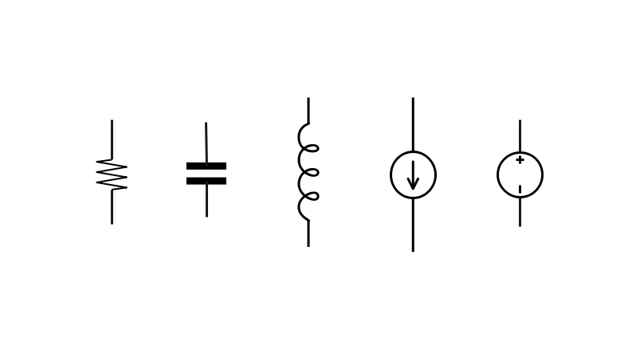
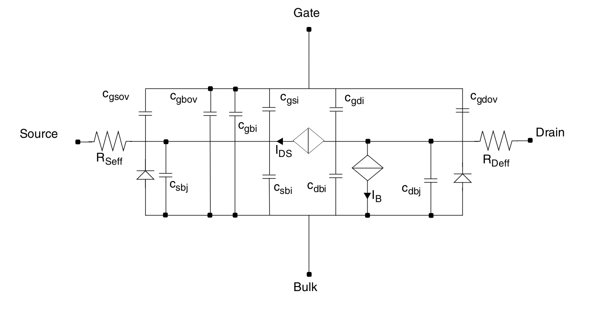

# 器件级电路描述

<center>龙子超</center>

JSON 格式的网表：也可理解为一种硬件描述语言(HDL)[[1]](#pecheux2005vhdl)，结构化部分(Structural)为其主体，行为描述(behavioral)部分统一放入子电路定义的 [SubModel 字段](#subckt-extension-based-on-the-response)单独处理。

为帮助理解，<font color=orange>硬件描述语言</font>与<font color=green>通用编程语言</font>中各概念可对应如下

1. <font color=orange>网表</font>即<font color=green>代码</font>------使用开放的 JSON 数据格式，用于描述电路。
2. <font color=orange>网表解析器</font>对应<font color=green>编译器</font>------分层嵌套定义的各级[<font color=orange>子电路</font>](#subckts)作为基本计算单元，如同<font color=green>类/函数对象</font>，将被编译为公有运算规则并实例化为若干含独立数据的对象，其中最小粒度的子电路称为[基本器件](#basic-instance-type)。
3. <font color=orange>方程组构建器</font>对应<font color=green>执行引擎</font>------为不同仿真类型各自定义计算图作为方程组构建器，嵌套计算子电路实例的方程余项及 Jacobian 矩阵，例如对 TRAN 仿真需计算 $\pmb{Q},\pmb{F}$ 及稀疏 Jacobian 矩阵 $\nabla_{\pmb{x}}\pmb{Q},\nabla_{\pmb{x}}\pmb{F},\nabla_{\pmb{p}}\pmb{Q},\nabla_{\pmb{p}}\pmb{F}$，其中 $\pmb{x}$ 是方程未知数，$\pmb{p}$ 是设计变量或输入参数。

[TOC]

## <span id=basic-circuit-element>可仿真网表的基本要素</span>

一个基本的可仿真 JSON 网表，其顶层 key 结构如下。

| 顶层key          | 含义               | 编程语言概念对照          |      |
| ---------------- | ------------------ | ------------------------- | ---- |
| `FileId`         | 本文件标识的字符串 | 类比 C/C++ 头文件宏保护   | 必须 |
| `include`        | 嵌套包含的其他网表 | 类比 C/C++ include 头文件 | 可选 |
| `GlobalVariable` | 全局变量           | 全局变量                  | 可选 |
| `SubCkts`        | 定义各类子电路     | 即编程语言中定义类/函数   | 可选 |
| `Simulation`     | 定义仿真条件       | 程序语言执行入口          | 可选 |
| `PreLoad`        | 执行引擎预加载程序 | 运行时动态库载入          | 可选 |
| `其他`           | 不做处理           | 注释                      | 可选 |

各编译型语言中许多已有概念可与电路描述语言一一对应，例如，`FileId`,`include`,`GlobalVariable`。这里对 `SubCkts,Simulation` 稍作说明，

1. 定义子电路模块(`subckt`)类似于于定义类(`Class`)。需要规定外部输入---对外节点&参数---如何影响子电路内部参数及对外响应。子电路定义统一放到`SubCkts`。

   ---

   *注：子电路与通用编程语言的函数/类的区别在于，函数输入输出的信息传递是单向的，但对子电路而言，在任何一种模拟信号仿真中，外部状态与内部状态相互影响，它们由一组物理方程---例如守恒律---联立耦合，求解方程组后同时获得整个电路的状态。*

   计算图的功能是构建方程组，进一步可被用于方程组求解。

   ---

2. 启动一个正确的电路仿真所需要的其他信息在 `Simulation` 中。具体而言这些信息一般有：
   - `PVT` 信息：即工艺角、温度等。同样尺寸的器件，在不同的 `PVT` 条件下也会有不同的物理性质。

   - 定义待仿真的电路，类似于 C/C++ 的 `main` 函数。

   - 仿真选项。按照基本仿真类型分类，

     - 直流稳态分析(`DC`, direct current)。例如在选项里指定求解方法。
     - 交流小信号分析(`AC`, alternating current)。例如在选项里指定扫描频率。
     - 瞬态仿真分析(`TRAN`, transient)，也可称为大信号分析。例如在选项里指定时间步长。

     其他的，也可定义例如 `DCAC` 混合分析。

这里以类、`main` 函数类比 `subckt` 和仿真入口电路，仅作概念说明。实际网表解析并不一定要将不同 `subckt` 编译为不同类类型，其余概念也不需一一对应。特别是考虑到适应更大规模电路仿真的存储、性能优化时，应编译为合适的数据结构。

### <span id=subckts>子电路定义及实例化语句</span>

这里讨论 HDL 的结构化部分(网表)，行为描述部分参考[基于电路响应的子电路扩展方法](#subckt-extension-based-on-the-response)。

1. `SubCkts`字段内每个键值对表示一种**子电路**的定义，子电路也可称之为**器件**。
2. 每个子电路可分解为若干更小的子电路。子电路分解可一直进行直到不能继续拆分。仿真内置支持的最小粒度子电路称为**基本器件**[[2]](#gunther2005modelling)[[6]](#najm2010circuit)，因此所有电路本质上都是由基本器件的组合所表达。
3. 任何一个子电路，在网表中可通过设定各**节点映射**(`ExternalNodes`)及**参数**(`InputParams`)的键值对来被使用/实例化。

#### <span id=basic-instance-type>基本器件</span>

一个可能需要支持的基本器件列表如下，

| `MasterName` | `ExternalNodes`           | `InputParams` | 备注                 |
| ------------ | ------------------------- | ------------- | -------------------- |
| `resistor`   | `left,right`              | `resistance`  | 电阻器               |
| `capacitor`  | `input,output`            | `capacitance` | 电容器               |
| `ncapacitor` | `OLDC,input,output`       | `capacitance` | 记录仿真中的旧电容值 |
| `inductor`   | `input,output`            | `inductance`  | 电感器               |
| `ninductor`  | `OLDL,input,output`       | `inductance`  | 记录仿真中的旧电感值 |
| `CS`         | `input,output`            | `current`     | 电流源               |
| `VS`         | `input,output`            | `voltage`     | 电压源               |
| `ICS`        | `input,output`            | `dc,ac`       | 理想电流源           |
| `IVS`        | `input,output`            | `dc,ac`       | 理想电压源           |
| `IPROBE`     | `left,right`              |               | IPROBE               |
| `VCCS`       | `left,right,input,output` | `MF`          | 电压受控电流源       |
| `CCCS`       | `iorigin,input,output`    | `MF`          | 电流受控电流源       |
| `VCVS`       | `left,right,input,output` | `MF`          | 电压受控电压源       |
| `CCVS`       | `iorigin,input,output`    | `MF`          | 电流受控电压源       |
| `ACVCCS`     | `left,right,input,output` | `MF`          | `AC` 电压受控电流源  |

`ICS,IVS` 的 `dc,ac` 表示 `DC/TRAN,AC` 分析中电流/电压值，`IPROBE` 在 `DC` 分析中等价于 `voltage` 为 0 的电压源，在 `AC` 分析中等价于 `current` 为 0 的电流源，受控电流/电压源 `VCCS,CCCS,VCVS,CCVS,ACVCCS` 的参数 `MF` 表示放大系数，其中 `ACVCCS` 仅在 `AC` 分析中提供电流。`ncapacitor,ninductor` 相比 `capacitor,inductor`，新增一个外部自由度 `OLDC,OLDL` 用于记录电容电感值。

注意，这里没有讨论忆阻器。

下图从左至右分别表示电阻、电容、电感、电流源、电压源



---

补充[[6,Chap 2]](#najm2010circuit)：考虑二端器件，器件两端电压差 $v(t)$，支路电流 $i(t)$，

- 无源器件(passive element)：如果基本器件方程，即本构关系，可写成
  $$
  i=f(v,\dot{v})\ or\ v=f(i,\dot{i}).
  $$
  则称该器件为无源器件。若 $f$ 是线性的则称之为线性器件，否则称为非线性器件; 若 $v=f(i)$ 或 $i=f(v)$，则称之为电阻型器件，否则称之为动态器件。

  - 电阻：电压受控型电阻：$i=f(v)$; 电流受控型电阻：$v=f(i)$。常说的电阻是电压受控型电阻。
  - 电容：电荷 $q$ 可表示为 $q=f(v)$，于是 $i=\frac{dq}{dt}\triangleq C(v)\cdot\frac{dv}{dt}$，其中 $C(v)=\frac{dq}{dv}$。
  - 电感：磁通量 $\phi$ 可表示为 $\phi=f(i)$，依据[法拉第定律(Faraday's law of induction)](https://en.wikipedia.org/wiki/Faraday%27s_law_of_induction)有 $v=\frac{d\phi}{dt}\triangleq L(i)\cdot\frac{di}{dt}$，其中 $L(i)=\frac{d\phi}{dv}$。

- 有源器件(active element)：如果 $v,i$ 满足下面四种情形之一，

  - $v$ 可表示为 $v=f(t)$，称为独立电压源。
  - $i$ 可表示为 $i=f(t)$，称为独立电流源。
  - $v$ 仅依赖于另一支路电流 $i_{origin}$，即 $v=f(i_{origin})$，称为受控电压源(`CVS`)。
  - $i$ 仅依赖于另两节点电压差$v_{origin}$，即 $i=f(v_{origin})$，称为受控电流源(`CCS`)。

  则称之为有源器件。这里提到的两种受控源也记作 `CCVS,VCCS`，上面基本器件列表中的 `VCVS,CCCS` 是两个变种。建立方程时，受控源与独立源如何影响方程的左右两端，应注意区分。

以上无源器件+有源器件合称为集总器件(lumped elements)，否则称为分布式器件(distributed devices)，例如传输线就属于分布式器件。集总器件构成的电路称为集总电路。两种器件的物理本质区别在于：当电磁场波长远大于电路尺寸时，对每个器件及节点可忽略电磁波效应，用集总电路建模; 反之，当不能忽略电磁波效应时，例如对于射频电路仿真中的器件，会有许多特性无法用集总电路建模。

实践中，多数元器件可以用上面的基本器件组成的等价电路来代替[[6,Chap 2.1.3]](#najm2010circuit)，通常可以做到不错的近似。

---

#### 实例化语句

不论对于基本器件还是自定义子电路，其实例化方式是一样的。实例名作为 key，后续跟类型名、对外节点连接、参数值。例如，一个电阻值为 `1e5`，左右端口接在节点 `vin,vout` 上的电阻器，其实例化语句是

```json
"r0":{
    "MasterName":"resistor",
    "ExternalNodes":{"left":"vin","right":"vout"},
    "InputParams":{"resistance":1e5},
    "ExternGALV":false
}
```

- `r0` 是该实例名称。
- `MasterName` 指出该实例的类型。
- `ExternalNodes` 指出该实例的两个对外节点 `left,right` 实际连接在 `vin,vout` 上。
- `InputParams` 指出该实例参数。
- `ExternGALV` 含义及作用参考[基本器件电流计](#internalnodes-and-galv-refrence)一节。
- `ExternalNodes,InputParams` 均可类比于函数的输入参数。

#### <span id=custom-subckt>自定义子电路</span>

这里以一个简单的电阻电容串联电路 `RC` 为例讨论最基本的自定义子电路的方法。子电路模块的行为建模可参考[基于电路响应的子电路扩展方法](#subckt-extension-based-on-the-response)一节，在那里将看到，基于这种扩展方法，包括 MOS 管在内的常用器件及子电路，都能用上面基本器件类型组装表达，行为建模所涉及的内部变量及计算方式统一放在一个字段中处理。

```json
"RC":{
    "comment":"运放内的小组件",
    "ExternalNodes":["left","right"],
    "InputParams":["R","C"],
    "DefaultParVals":{"R":1e5,"C":1e-13},
    "InternalNodes":["vm"],
    "Schematic":{
        "Rm":{"MasterName":"resistor",
              "ExternalNodes":{"left":"left","right":"vm"},
              "InputParams":{"resistance":"R"}},
        "Cm":{"MasterName":"capacitor",
              "ExternalNodes":{"input":"vm","output":"right"},
              "InputParams":{"capacitance":"C"}}
    }
}
```

| 子电路定义内容   | 含义           | 备注 | 例子/说明                                                    |
| ---------------- | -------------- | ---- | ------------------------------------------------------------ |
| `ExternalNodes`  | 对外节点列表   | 必须 | `["left","right"]`                                           |
| `InputParams`    | 输入参数名列表 | 必须 | `["R","C"]`                                                  |
| `InternalNodes`  | 内部节点名列表 | 必须 | `["vm"]`                                                     |
| `Schematic`      | 内部子电路分解 | 必须 | `{"Rm":{...},"Cm":{...}}`                                    |
| `SubModel`       | 内部变量模型   | 可选 | [基于电路响应的子电路扩展方法](#subckt-extension-based-on-the-response) |
| `DefaultParVals` | 输入参数默认值 | 可选 | `{"R":1e5,"C":1e-13}`                                        |

`Schematic` 的详细说明：内部子电路分解，在 `Schematic` 中包含实例化两个子电路 `Rm,Cm` 的语句，

> ```
> "Schematic":{
>        "Rm":{"MasterName":"resistor",
>              "ExternalNodes":{"left":"left","right":"vm"},
>              "InputParams":{ "resistance":"R"}},
>        "Cm":{"MasterName":"capacitor",
>              "ExternalNodes":{"input":"vm","output":"right"},
>              "InputParams":{"capacitance":"C"}}
> }
> ```

1. `Rm,Cm` 的类型通过 `MasterName` 指定，分别为 `resistor,capacitor` 类型，（在这个例子中恰巧）属于基本器件。

2. `Rm,Cm` 的对外节点分别连接到 `ExternalNodes` 及 `InternalNodes` 中的某些节点上。如 `Rm` 的节点 `left` 连接到上层 `RC` 的节点 `left` ，而 `right` 连接到上层内部节点 `vm`。从编译角度来看，`Rm,Cm` 的 `ExternalNodes` 感知域是

   - 上层 `ExternalNodes`。
   - 上层 `InternalNodes`。

   `Schematic` 中引用的 `ExternalNodes` = 定义的 `ExternalNodes`+`InternalNodes`。

3. `Rm,Cm` 的参数 `InputParams:resistance,capacitance` 由上层输入参数 `R,C` 直接映射给出。从编译角度看，计算 `Rm,Cm` 的 `InputParams` 感知域是

   - 全局变量 `GlobalVariable`。
   - 上层 `InputParams`。
   - 字段 `IntrinsicParams` 中的参数。参考[基于电路响应的子电路扩展方法](#subckt-extension-based-on-the-response)一节。

   `Schematic` 中引用的 `InputParams` $\subset$ 定义的 `InputParams`+`IntrinsicParams`+`GlobalVariable`。

   当前例子是直接引用 `InputParams`，可用同样的方法引用 `GlobalVariable` 及 `IntrinsicParams`，其中后者在被引用前还需在仿真中额外调用 `SubModel` 来计算。


---

*注：要考虑参数映射的完备的实现，从编译角度看，就必须讨论清楚子电路参数内外依赖关系。物理上，内部参数/变量值依赖于外部输入 `InputParams` 和内外部节点信号。其中 `DC,AC` 仿真参数依赖于 `DC` 稳态信号，`TRAN` 仿真参数依赖于 `TRAN` 瞬时信号。*

*搞清楚这种依赖关系，就可以定义更大一类器件，比如[由尺寸决定阻值的电阻器](#example-size-dependent-resistor)。典型的 MOS 管模型如 [BSIM Model](https://bsim.berkeley.edu/) 中，MOS 管被等效为一个子电路(参考下图 BSIM4 模型[[3]](#liu2001mosfet)[[4]](#spectremod))，其内部参数状态依赖于 MOS 管本身的尺寸等信息及四端电压，[在这里也进行了类似的建模分解](#example-mos-modeling)。*

  

---
### <span id=simulation-entry>仿真入口</span>

每一个仿真 case 也是一个子电路定义，区别在于：

1. 仿真 case 包含 `SimInfo,SimulationOption` 字段。
   - `SimInfo`：可以用来存放 PVT 信息等必要信息。这些信息对于电学特性受 PVT 影响的器件而言是必须的。
   - `SimulationOption`：在这里规定对应仿真类型的仿真选项。例如对 `AC` 分析规定扫频频点 `frequency=[0,1,10,100,1000]`。
2. 必须包含`Schematic` 字段，类似于 C/C++ 中的 `main` 函数，但其他所有子电路定义字段可选。
3. 仿真 case 不能有外部节点，即 `ExternalNodes` 为空。因为若要对此子电路启动仿真，这个子电路的所有内部器件及激励源（即独立电流源、电压源）应当构成一个封闭系统。

这里以一个最简单的电路为例介绍如何定义仿真 case。这个电路仅包含一个 `RC` 模块和一个理想电压源 `IVS`，其 json 网表如下，其中关于 `RC` 的具体定义可以参考[上一节的自定义子电路](#custom-subckt)，这里不再赘述。

```json
{
    "FileId":"only-RC",
    "SubCkts":{"RC":{"略"},"IVS":{"略"},
        "ONLYRC":{
            "ExternalNodes":[],
            "InputParams":["res","cap","VDDAC"],
            "DefaultParVals":{"res":1e5,"cap":1e-13,"VDDAC":1},
            "InternalNodes":["gnd","vdd"],
            "Schematic":{
                "rc":{"MasterName":"RC",
                      "ExternalNodes":{"left":"vdd","right":"gnd"},
                      "InputParams":{"R":"res","C":"cap"}},
                "ivs":{"MasterName":"IVS",
                      "ExternalNodes":{"input":"gnd","output":"vdd"},
                      "InputParams":{"dc":0,"ac":"VDDAC"}}
            }
        }
    },
    "Simulation":{
        "case0":{
            "SimInfo":{"Corner":"ff","Voltage":"6v","Temperature":"27"},
            "Schematic":{
                "circuit":{
                    "MasterName":"ONLYRC",
                    "ExternalNodes":{},
                    "InputParams":{"res":7e4,"cap":1.3e-13,"VDDAC":1}
                }
            },
            "SimulationOption":{"AC":{"frequency":[0,1,10,100,1000]}}
        }
    }
}
```

这里，`Simulation` 下定义了一个仿真 case，即 `case0`。可在 `Simulation` 下同时定义多个仿真 case 如 `case1,case2,...`。每个 case 可指定不同的仿真条件及选项，并被分别启动，各 case 共享 `GlobalVariable` 但电路状态相互独立。

## <span id=subckt-extension-based-on-the-response>基于电路响应的子电路扩展方法</span>

这里讨论 HDL 的行为描述部分，内部变量统一由 SubModel 字段处理。

### <span id=example-size-dependent-resistor>由尺寸决定阻值的电阻器</span>

考虑一个由尺寸 `Rlength,Rwidth` 决定阻值 `resistance` 的电阻器类型 `SizeDepResistor`，
$$
resistance = 1e2*Rlength/Rwidth
$$
这段代码假设是由第三方(如Foundry或用户)定义的，需由仿真程序调用。为此，`SizeDepResistor` 的定义中引入了 `SubModel` 字段。

- `SubModel` 的目的是让编译器可以正确生成计算内部变量---这里是 `resistance`---的函数对象并供仿真程序调用。
- 不同编程语言实现的仿真器，可能使用不同的 `SubModel` 实例化方式。编译器+仿真器需自动生成该函数的梯度反传(or 前传)：以使得方程组关于系统信号、全局变量的导数可以自动计算。其中，复数函数导数即通常意义下的复数导数，这要求如果 `SubModel` 是复数运算则该函数应该是全纯的。
- `SubModel` 下包含 `IntrinsicParams` 字段，其值为内部变量名列表，供该分析下各 `Instance` 实例化时参数索引。
- 各分析中内部变量含义及个数相同。仅特定仿真类型中可使用的 `SubModel` 需说明。
- `SubModel` 的输入是内外节点信号与输入参数。`AC` 分析中，内部变量是输入参数及仿真角频率 $\omega=2\pi\cdot f$ 的函数，与外接节点无关。
- 下面给出的 `SubModel` 及可能的编译/实例化实现为实验性质，任何编译器/仿真器达成上述五条要求均可。

```json
"SizeDepResistor":{
    "comment":"由尺寸决定阻值的电阻器",
    "ExternalNodes":["left","right"],
    "InputParams":["Rlength","Rwidth"],
    "DefaultParVals":{"Rlength":1,"Rwidth":1},
    "InternalNodes":[],
    "SubModel":{
        "Expr":"[1e2*Rlength/Rwidth,]",
        "IntrinsicParams":["resistance"]
    },
    "Schematic":{
        "R":{
            "MasterName":"resistor",
            "ExternalNodes":{"left":"left","right":"right"},
            "InputParams":{"resistance":"resistance"}
        }
    }
}
```

上述 `SubModel` 例子中，可考虑使用如下 Julia 代码生成函数对象

```julia
function GenerateSubmodelFromExpr(ArgsString, ExprString)
    argssymbol = map(Symbol, ArgsString)
    expr = Meta.parse(ExprString)
    submodel = @eval function ($(argssymbol...),omega=0)
        # omega 是角频率，是为 AC 分析调用 submodel 设置的参数位
        $expr
    end
    return submodel
end
```

```julia
# 仿真中，submodel 的输入是：ExternalNodes+InternalNodes+InputParams
# 编译器可直接从 Json 网表中获得下面 ArgsString, ExprString 的信息
ArgsString = ["left","right","Rlength","Rwidth"]
ExprString = "[1e2*Rlength/Rwidth,]"
# 生成函数对象
submodel = GenerateSubModelFromExpr(ArgsString, ExprString)
# 生成的 submodel 等价于下面的函数
function submodel_understandable(left, right, Rlength, Rwidth, omega=0)
    return [1e2*Rlength/Rwidth,] # 返回内部变量向量，这个数据类型也适用于具有多个内部变量的情形
end
# DC or TRAN 分析计算内部变量
intrinsicparams = submodel(left,right,input,output)
# 如果是频域分析，还将传入 omega=2pi*frequency
# intrinsicparams = submodel(left,right,Rlength,Rwidth,omega)
ivccs = intrinsicparams[1]
```

仿真时将 `left,right` 这些方程自变量及参数 `Rlength,Rwidth` 传入 `submodel`, `submodel` 返回内部变量向量。


### <span id=example-mos-modeling>MOS管</span>

一个更复杂的例子：MOS 管。考虑类型名为 `NMOS_TYPE1` 的 MOS 管。它具有四个对外节点，`gate,source,drain,bulk`，此外它有两个参数：沟道长度 `MosL` 和宽度 `MosW`。在外部指定四个节点连接及两个参数即可实例化这类 `NMOS_TYPE1` 型器件，

```json
"n0":{
    "MasterName":"NMOS_TYPE1",
    "ExternalNodes":{"gate":"vin","source":"s","drain":"d","bulk":"b"},
    "InputParams":{"MosL":0.1,"MosW":10}
}
```

`NMOS_TYPE1` 型 MOS 管定义如下，

```json
"NMOS_TYPE1":{
    "comment":"工艺发布NMos",
    "ExternalNodes":["gate","source","drain","bulk"],
    "InputParams":["MosL","MosW"],
    "DefaultParVals":{"MosL":null,"MosW":null},
    "InternalNodes":[],
    "SubModel":{
        "Analysis":["DC","TRAN"],
        "ModelLoader":"SimInfo->lut_v0.NMosLookupLevel0(\"NMOS_TYPE1\", /path/to/data; SimInfo=SimInfo)",
        "IntrinsicParams":["ID","GDS","CDD","CSS","CGG","CGS","CGD","GM","GMB"]
    },
    "Schematic":{
        "ids":{
            "MasterName":"ICS",
            "ExternalNodes":{"input":"source","output":"drain"},
            "InputParams":{"dc":"ID","ac":0}
        },
        "template":{
            "MasterName":"MosSmallSignalTemplate",
            "ExternalNodes":{"gate":"gate","source":"source","drain":"drain","bulk":"bulk"},
            "InputParams":{"GDS":"GDS","CDD":"CDD","CSS":"CSS","CGG":"CGG","CGS":"CGS","CGD":"CGD","GM":"GM","GMB":"GMB"}
        }
    }
}
```

- 对于 `DC` 分析，`NMOS_TYPE1` 等效于一个电流源 `Schematic:ids`，需要计算电流值 `ID`。
- 对于 `AC` 分析，`NMOS_TYPE1` 等效于 `MosSmallSignalTemplate` 型子电路 `template`。其定义可以在附录 [`MosSmallSignalTemplate` 类型子电路](#mos-small-signal-template)中找到，它由若干 `ncapacitor,ACVCCS` 组成。实例化 `template` 需要提供 `GDS,CGG,GM` 等参数，这些参数在 `DC,TRAN` 分析中依据偏置电压进行计算。
- `NMOS_TYPE1` 的 `SubModel` 仅在 `DC,TRAN` 分析中有效，不可单独在 `AC` 分析中使用。

---

*注：物理上，电路的微观行为是瞬态的，但实际应用仿真时，往往因为对物理实体本身的描述无法穷尽、简化模型、节省计算量等原因，分为 `DC,AC,TRAN` 等分析类别分别进行仿真。*

*理论上，对同一个器件实例，例如 MOS 管，可能可以在不同的仿真类型中采用不同的更好的子电路分解方法，但这将增加仿真编译实现的难度。*

---

与前面[由尺寸决定阻值的电阻器](#example-size-dependent-resistor)例子的 `SubModel` 有所区别，这里直接加载现成的代码，并引入了仿真信息 `SimInfo`。可考虑使用如下 Julia 代码生成函数对象

```julia
function GenerateSubModelFromModelLoader(ModelLoaderString, SimInfo)
	expr = Meta.parse(ModelLoaderString)
    # 由于 Julia 的预编译特性，在 Main 顶层模块运行 ModelLoader
	submodel = Main.eval(:($expr($SimInfo)))
	return submodel
end
```

```julia
# 假设仿真信息 SimInfo 会传入这一段代码的作用域
SimInfo = Dict("Corner"=>"ff","Voltage"=>"6v","Temperature"=>"27")
ModelLoaderString = "SimInfo->lut_v0.NMosLookupLevel0(\"NMOS_TYPE1\", /path/to/data; SimInfo=SimInfo)"
# 生成 submodel
submodel = GenerateSubModelFromModelLoader(ModelLoaderString,SimInfo)
# 计算内部变量
intrinsicparams = submodel(gate,source,drain,bulk,MosL,MosW)
ID = intrinsicparams[1]
```

### `SubModel` 定义规范

| 内容              | 含义               | 备注                                                         |
| ----------------- | ------------------ | ------------------------------------------------------------ |
| `IntrinsicParams` | 内部变量列表       | 必须。子模型依此顺序返回参数向量                             |
| `Analysis`        | 可支持仿真类型列表 | 可选。仅在对应仿真类型中可调用子模型                         |
| `Expr`            | 子模型表达式       | 与 `ModelLoader` 二选一.具体支持范围依仿真实现程序语言而定。生成的子模型无 `SimInfo` 信息。|
| `ModelLoader`     | 子模型加载         | 与 `Expr` 二选一。 `SimInfo` 到子模型函数指针/对象的映射。   |

## <span id=galv-reference> 基本器件电流计及其索引</span>

- 基本器件可设定 `ExternGALV` 为 `true` 或 `false`，这将决定

  - 这一支路广义电流是否作为电路方程的自由变量。
  - 编译网表阶段其他器件/子电路是否可引用此支路电流。
  - `resistor,capacitor,CS` 中默认为 `false`。`inductor,VS` 必须是`true`。`resistor` 以从 `left` 流向 `right` 的电流为正，反向为负，`capacitor,inductor,CS,VS` 以从 `input` 流向 `output` 的电流为正，反向为负。
  - 基本器件的 `GALV` 可在编译时添加到上层子电路定义中的 `InternalNodes` 字段中，也可在网表中显式写在 `InternalNodes` 中。这不违反前面的规定：`Schematic` 中引用的 `ExternalNodes` = 定义的 `ExternalNodes`+`InternalNodes`。

- 同级子电路可索引此基本器件的 `GALV`。

  - 子电路定义中，同一 `Schematic` 下的器件为同级器件。例如[附录：小信号等效电路](#mos-small-signal-template)中的 `gds,cdd` 等互为同级器件，而 `gds` 与[NMOS_TYPE1](#example-mos-modeling)定义中的 `ids` 不是同级器件，与 `NMOS_TYPE1` 型 `n0` 器件本身也不是同级器件。

  - 索引方式为 `["elementname","GALV"]`。例如

    ```python
    # 索引同级 "r0" 的 "GALV"
    ["r0","GALV"]
    ```

    它等价于该子电路的内部节点，且应当出现在 `InternalNodes` 中，因为编译时，`Schematic` 中每个实例的外接节点，都将从该子电路顶层 `ExternalNodes,InternalNodes` 中寻找。

从上述定义可以看出，即便 `GALV` 与节点的物理含义不同，但对于编译器来说，`GALV` 与 `nodes` 是等价的，仿真中的数值代数运算里，这两者也是类似的。如果要暴露自定义子电路下的某支路电流，可选择如下做法之一：

- 在外层网表为该支路加上一个压差为 `0` 的理想电压源。
- 为其中的某个非电容型基本器件设置 `ExternGALV:true`。

---

*按照稀疏表分析法(Sparse Tableau Analysis)[[7]](#hachtel1971sparse)，所有节点电压及所有支路电流都将作为仿真的自由变量，这导致当器件较多时计算量过大。*

*与之对照的是节点分析法([Nodal Analysis](https://en.wikipedia.org/wiki/Nodal_analysis))[[8]](#dimo1975nodal)，仿真中将仅以节点电压为自由变量，对每个节点依据基尔霍夫电流定律(Kirchhoff’s Current Law, KCL)建立方程。然而，节点分析法仅支持本构关系(即电流-电压关系)可表达为 $i=f(v,\dot{v})$ 的器件。具体来说：*

- *每个电压源、电感还将新增一个节点电压方程。*
- *电压源、电感本构关系无法表达为 $i=f(v,\dot{v})$，其支路电流应当作为新增的自由变量。*
  - *电压源支路电流 $i$ 实际依赖于整个电路。*
  - *电感本构关系为 $v=\dot{\phi}(i)$，其中 $\phi$ 是磁通量。*

*出于以上原因，改进的节点分析法(Modified Nodal Analysis, MNA)[[9]](#ho1975modified)被引入以支持 `inductor,VS`。此外，任何控制类电流，例如电流受控电流源、电流受控电压源中的控制电流，它们作为自由变量时，编译仿真的实现更简单。在网表中为基本器件引入 `ExternGALV` 字段，在编译阶段即可确定，这一支路电流是否应当作为自由变量并引入新的方程。当所有基本器件均设置 `ExternalGALV=true` 时即等价于稀疏表分析，所有允许不设置电流计的基本器件均设置 `ExternalGALV=false` 时即等价于改进的节点分析。*

---


## 参考文献

<span id=pecheux2005vhdl>[1] Pêcheux, François, Christophe Lallement, and Alain Vachoux. "VHDL-AMS and Verilog-AMS as alternative hardware description languages for efficient modeling of multidiscipline systems." *IEEE transactions on Computer-Aided design of integrated Circuits and Systems* 24.2 (2005): 204-225.</span>

<span id=gunther2005modelling>[2] Günther, Michael, Uwe Feldmann, and Jan ter Maten. "Modelling and discretization of circuit problems." *Handbook of numerical analysis* 13 (2005): 523-659.</span>

<span id=liu2001mosfet>[3] Liu, William. "MOSFET models for SPICE simulation." *Including BSIM3v3 and BSIM4* (2001).</span>

<span id=spectremod>[4] Cadence. Simulator Circuit Components and Device Models References</span>

<span id=sahrling2021analog>[5] Sahrling, Mikael. *Analog Circuit Simulators for Integrated Circuit Designers: Numerical Recipes in Python*. Springer Nature, 2021.</span>

<span id=najm2010circuit>[6] Najm, Farid N. *Circuit simulation*. John Wiley & Sons, 2010.</span>

<span id=hachtel1971sparse>[7] Hachtel, Gary, R. Brayton, and Fred Gustavson. "The sparse tableau approach to network analysis and design." *IEEE Transactions on circuit theory* 18.1 (1971): 101-113.</span>

<span id=dimo1975nodal>\[8] Dimo, Paul. "Nodal analysis of power systems." (1975).</span>

<span id=ho1975modified>[9] Ho, Chung-Wen, Albert Ruehli, and Pierce Brennan. "The modified nodal approach to network analysis." *IEEE Transactions on circuits and systems* 22.6 (1975): 504-509.</span>

<span id=berkeley-SPICE-elements>[10] http://bwrcs.eecs.berkeley.edu/Classes/IcBook/SPICE/UserGuide/elements_fr.html</span>

<span id=fijnvandraat2006time>[11] Fijnvandraat, J. G., et al. "Time domain analog circuit simulation." Journal of Computational and Applied Mathematics 185.2 (2006): 441-459.</span>

<span id=nastov2007fundamentals>[12] Nastov, Ognen, et al. "Fundamentals of fast simulation algorithms for RF circuits." Proceedings of the IEEE 95.3 (2007): 600-621.</span>

## 附录

### <span id=mos-small-signal-template>`MosSmallSignalTemplate` 类型子电路</span>


```json
"MosSmallSignalTemplate":{
    "ExternalNodes":["gate","source","drain","bulk"],
    "InputParams":["GDS","CDD","CSS","CGG","CGS","CGD","GM","GMB"],
    "DefaultParVals":{"GDS":null,"CDD":null,"CSS":null,"CGG":null,"CGS":null,"CGD":null,"GM":null,"GMB":null},
    "InternalNodes":["OLDCDD","OLDCSS","OLDCGG","OLDCGS","OLDCGD"],
    "Schematic":{
        "infr":{
            "MasterName":"resistor",
            "ExternalNodes":{"left":"drain","right":"source"},
            "InputParams":{"resistance":1e1000}
        },
        "gds":{
            "MasterName":"ACVCCS",
            "ExternalNodes":{"left":"drain","right":"source","input":"drain","output":"source"},
            "InputParams":{"MF":"GDS"}
        },
        "cdd":{
            "MasterName":"ncapacitor",
            "ExternalNodes":{"OLDC":"OLDCDD","input":"drain","output":"bulk"},
            "InputParams":{"capacitance":"CDD"}
        },
        "css":{
            "MasterName":"ncapacitor",
            "ExternalNodes":{"OLDC":"OLDCSS","input":"source","output":"bulk"},
            "InputParams":{"capacitance":"CSS"}
        },
        "cgg":{
            "MasterName":"ncapacitor",
            "ExternalNodes":{"OLDC":"OLDCGG","input":"gate","output":"bulk"},
            "InputParams":{"capacitance":"CGG"}
        },
        "cgs":{
            "MasterName":"ncapacitor",
            "ExternalNodes":{"OLDC":"OLDCGS","input":"gate","output":"source"},
            "InputParams":{"capacitance":"CGS"}
        },
        "cgd":{
            "MasterName":"ncapacitor",
            "ExternalNodes":{"OLDC":"OLDCGD","input":"gate","output":"drain"},
            "InputParams":{"capacitance":"CGD"}
        },
        "gm":{
            "MasterName":"ACVCCS",
            "ExternalNodes":{
                "left":"gate","right":"source","input":"drain","output":"source"
            },
            "InputParams":{"MF":"GM"}
        },
        "gmb":{
            "MasterName":"ACVCCS",
            "ExternalNodes":{
                "left":"bulk","right":"source","input":"drain","output":"source"
            },
            "InputParams":{"MF":"GMB"}
        }
    }
}
```


